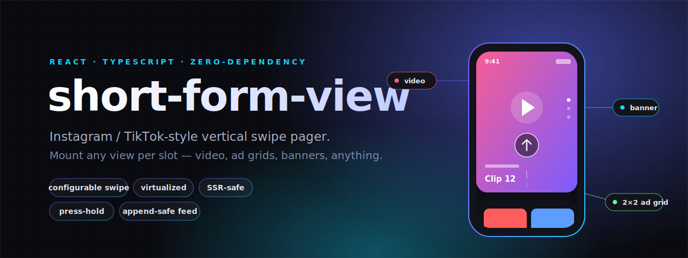

<div align="center">



<br/>

**Instagram / TikTok-style vertical swipe pager for React.**
Mount any view per slot — video, ad grids, banners, anything — into one smooth, virtualized, SSR-safe feed.

<br/>


</div>

---

## Why

It is **not** a video player. It is a *view connector*. You give it a list and a render function; it connects arbitrary full-viewport views into a swipeable feed. Mixed content with no constraint is the whole point:

```
video · video · video · ad (2×2 HTML grid) · video · video · video · ad (video + bottom banner) · …
```

- **Gesture-driven** — configurable swipe threshold, velocity flick, edge resistance. Touch, mouse, wheel, and keyboard all drive one engine.
- **Virtualized** — only the active item ± overscan are mounted.
- **Append-safe** — growing `data` from an API mid-scroll never reflows or remounts existing items.
- **Zero runtime dependency** — no animation library, no CSS import. Just React.
- **SSR-safe** — works in Next.js (App Router and Pages).
- **Rich callbacks** — swipe, item enter/leave lifecycle, and left/center/right press-hold + tap zones.
- **No re-render on drag** — the track transform is written imperatively via `requestAnimationFrame`.

## Install

```bash
pnpm add short-form-view   # react >= 18 is a peer dependency
```

## Quick start

```tsx
'use client'
import { useCallback, useState } from 'react'
import { ShortFormView } from 'short-form-view'

type FeedItem =
  | { id: string; kind: 'video'; src: string }
  | { id: string; kind: 'ad'; tiles: string[] }

export default function Feed() {
  const [items, setItems] = useState<FeedItem[]>(initialItems)

  const loadMore = useCallback(() => {
    fetchMore().then((more) => setItems((prev) => [...prev, ...more]))
  }, [])

  return (
    <ShortFormView<FeedItem>
      data={items}
      keyExtractor={(it) => it.id}
      threshold={0.2}                                  // commit a swipe at 20% of viewport
      onSwiped={({ from, to, direction }) => track(from, to, direction)}
      onIndexChange={(i, { reason }) => console.log('now at', i, 'via', reason)}
      onEndReached={loadMore}                          // append more, no reflow
      onHoldStart={({ side }) => pauseOrPeek(side)}    // press-and-hold left/right
      renderItem={(item, state) =>
        item.kind === 'video'
          ? <video src={item.src} muted loop autoPlay={state.isActive}
                   style={{ width: '100%', height: '100%', objectFit: 'cover' }} />
          : <AdGrid tiles={item.tiles} />              // any custom view
      }
    />
  )
}
```

A video reads `state.isActive` to play only while focused; an ad view ignores it. There is no limit on what a slot can render.

## What you get

| | |
|---|---|
| **Navigation** | drag · wheel/trackpad · keyboard (arrows, page, home/end) · controlled & uncontrolled `index` · imperative `ref` (`scrollToIndex` / `next` / `prev`) |
| **Tuning** | `threshold` (fraction or px) · `velocityThreshold` · `resistance` · `loop` · `transitionDuration` · `easing` · `overscan` |
| **Callbacks** | `onSwiped` · `onIndexChange` · `onItemEnter` / `onItemLeave` · `onEndReached` · `onHoldStart` / `onHoldEnd` / `onTapZone` |
| **Per-item state** | `isActive` · `isVisible` · `isSnapping` · `distance` · `index` / `activeIndex` |

**Full props, types, and the imperative handle:** see the [package README](packages/short-form-view/README.md).

## Press-and-hold vs. swipe

The active slot is overlaid with left / center / right zones. A stationary press past `holdDelay` fires `onHoldStart` (pause the video, dim the UI); a quick press-release fires `onTapZone`. Any vertical movement past a small slop becomes a swipe instead — so holding and swiping never fight.

## Repository

| Path | What |
|------|------|
| [`packages/short-form-view`](packages/short-form-view) | the library — gesture engine, virtualization, item lifecycle, SSR utils |
| [`examples/next-demo`](examples/next-demo) | Next.js App Router demo: mixed video / 2×2 ad-grid / video-ad feed with infinite append |
| [`docs/superpowers`](docs/superpowers) | design spec + implementation plan |

```bash
pnpm install
pnpm -C examples/next-demo dev          # http://localhost:3100
pnpm test                                # unit (vitest)
pnpm -C packages/short-form-view test:cov
pnpm -C examples/next-demo test:e2e      # Playwright E2E + visual
```

## License

[MIT](LICENSE)
